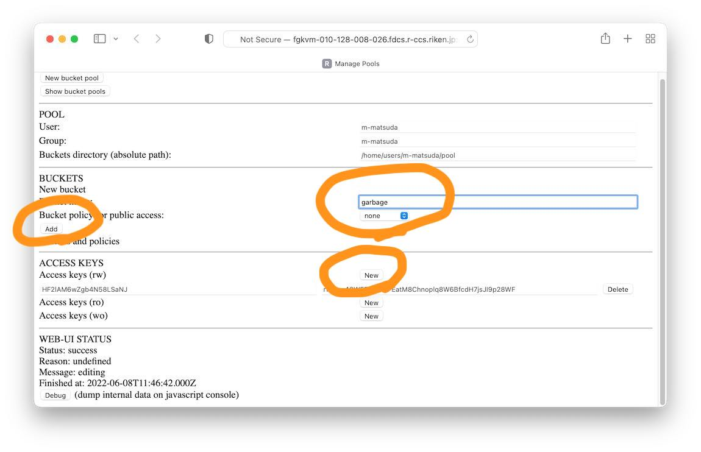

# Lenticularis-S3 User's Guide

## Quick Setup of Buckets

Accessing the management Web-UI site first shows the two buttons: "New
bucket pool" and "Show bucket pools".  Click "New bucket pool".


The pool creation page is to create a _bucket pool_.  A bucket pool is
a management unit in Lens3 and it is associated to a directory in the
filesystem in which a MinIO will run.  Enter a directory (which needs
to be writable) and click the "Create" button.


The pool edit page is to add buckets and access keys.  Click "Add" or
"New" buttons.  A bucket has a bucket-policy that specifies a
permission to public accesses: "none", "upload", "download", or
"public".  A bucket with the "none"-policy is accessible only with
access-keys.  These policy names are from MinIO.

Each access-key has a key-policy: "readwrite", "readonly", or
"writeonly".  Accesses to buckets/files are restricted by these
policies.  These policy names are from MinIO.

Clicking "Show bucket pool" on the top moves to a pool list page which
will display a summaries of pools created.



The pool list page shows a list of pools.  Clicking "Edit" moves back
to the page for addition of buckets and access keys.  Clicking "Delete"
removes the pool.


## S3 Client Setting

The followng example shows an access to an endpoint using the AWS CLI.
An access-key pair is provided by Lens3 Web-UI.

```
$ cat .aws/credentials
[default]
aws_access_key_id = WoRKvRhrdaMNSlkZcJCB
aws_secret_access_key = DzZv57R8wBIuVZdtAkE1uK1HoebLPMzKM6obA4IDqOhaLIBf

$ aws --endpoint-url=http://lens3.example.com/ s3 ls s3://somebucket1/
```

## Restrictions of Lenticularis-S3

### No Control on File and Bucket Properties

Lens3 does not provide control on properties of files and buckets.  A
bucket can only have a public access policy.

### Bucket Naming Restrictions

Bucket names must be in lowercase alphanums and "-".  Lens3 bans dots.
Also, Lens3 bans names "aws", "amazon", "minio", and the names that
begin with "goog" and "g00g".

### Residue Files

Running MinIO leaves a directory ".minio.sys" in the pool (in the
buckets-directory).

### Bucket-Pool State

A bucket-pool has a state reflecting the state of a MinIO instance.
It does not include the process status of a MinIO instance.

* Bucket-pool state
  * __None__ is quickly moves to the INITIAL state.
  * __INITIAL__ indicates some setup is not performed yet on a MinIO
    instance (a transient state).
  * __READY__ indicates a service is ready, a setup for servicing is
    done.  It does not mean a MinIO instance is running.
  * __DISABLED__ indicates a pool is temporarily unusable.  It may
    transition between "READY" and "DISABLED" by actions of a user or
    an administrator.  The causes of a transition include an
    expiry of a pool, disabling a user account, or making a pool
    offline.
  * __INOPERABLE__ indicates an error state and a pool is
    permanently unusable.  It has failed to run a MinIO.  This pool
    cannot be used and should be removed.

### Other Limitations

* Lens3 does not support listing of buckets by `aws s3 ls`.  Simply,
Lens3 prohibits accesses to the "/" of the bucket namespace, because
the bucket namespace is shared by multiple users (and MinIO
processes).

## Glossary

* __Pool__: A management unit of S3 buckets.  It corresponds to a
  single MinIO instance.

## Changes from v1.1 to v1.2

* Host-style naming of buckets is dropped.
* Some rich features are dropped.
* Bucket name space is shared by all users.  Bucket names must be
  exclusive.
* Some locking in accessing Redis are omitted.  Operations by an
  administrator might be sloppy.
