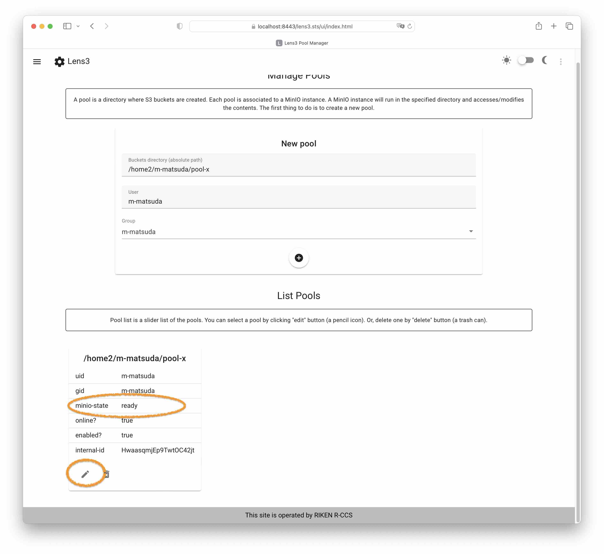
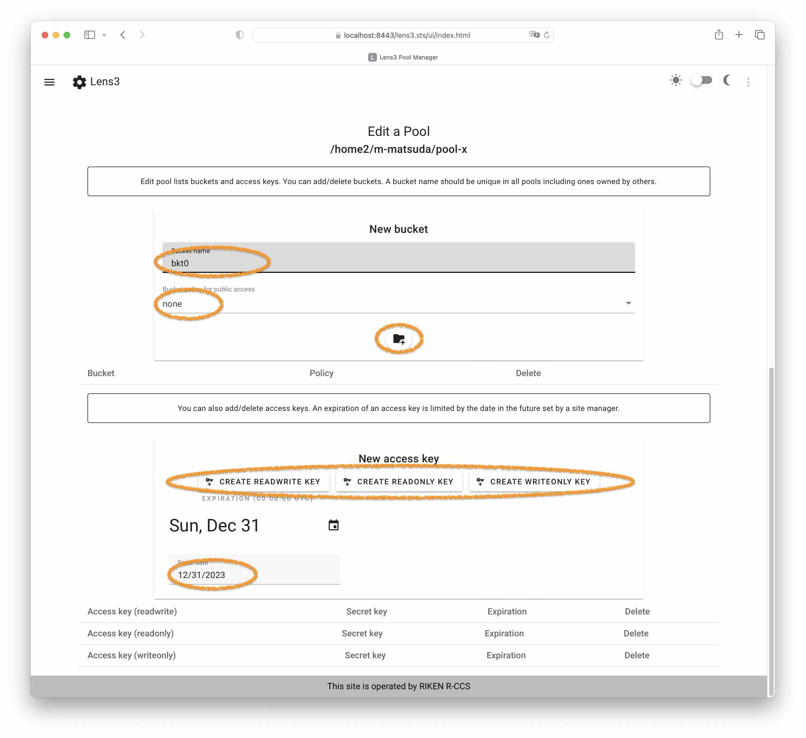

# Lenticularis-S3 User's Guide

## Quick Setup of Buckets

__Manage Pools__ section first shows when accessing the Web-UI.  A
_pool_ or a _bucket pool_ is a directory to hold buckets.  Each pool
corresponds to a single backend S3 server instance.  Buckets and
access keys are associated to a pool.

The first step is to create a pool.  Fill a directory in a full path,
select a unix group, then click the create button (a plus icon).  The
directory needs to be writable to the user:group pair.


__List Pools__ section displays a list of existing pools.  It is a
slider list.  Check the "minio-state" of the pool just created.  It
should be _ready_.  A pool is unusable when it is in the _inoperable_
state (often, the reason is the directory is not writable).

Select a pool by clicking the edit button (a pencil icon).  It opens
__Edit a Pool__ section.  Or, delete a pool by clicking the delete
button (a trash-can icon).



__Edit a Pool__ section has two independent subsections -- one for
buckets and the other for access keys.

A bucket has a bucket-policy that specifies a permission to public
access: _none_, _upload_, _download_, or _public_.  A bucket with the
_none_-policy is accessible only with access keys.

An access key has a key-policy: _readwrite_, _readonly_, or
_writeonly_.  Accesses to buckets are restricted by these policies.
An expiration date must be a future.  An expiration date is actually a
time in second, but the UI only handles it by date at midnight UTC.



The last figure shows a screenshot after some operations.  It has one
private bucket and two access keys (one readwrite, one readonly).

The S3-endpoint URL can be found in the menu at the top-left corner.


### CAVEATS

- Pools, buckets, and access keys will be expired in 180 days after
  its creation (it is site configurable).
- A user will be expired in 180 days, too, from the last access to
  Registrar.  However, an expiration of a pool will come first.

### Simple UI

The UI is created with vuejs+vuetify.  It is not of your taste, try
simple UI.  Simple UI reveals interactions with Web-UI.  If you are
currently accessing the UI by a URL ending with "⋯/ui/index.html",
the simple UI is available at "⋯/ui2/index.html".

## S3 Client Access Example

The following example shows accessing an endpoint using the AWS CLI.
An access key pair can be obtained by Lens3 Web-UI.  Lens3 only works
with the signature algorithm v4, and it is specified as "s3v4".

```
$ cat ~/.aws/config
[default]
s3 =
    signature_version = s3v4

$ cat ~/.aws/credentials
[default]
aws_access_key_id = WoRKvRhrdaMNSlkZcJCB
aws_secret_access_key = DzZv57R8wBIuVZdtAkE1uK1HoebLPMzKM6obA4IDqOhaLIBf

$ aws --endpoint-url=http://lens3.example.com/ s3 ls s3://somebucket1/
```

### Diagnosing Access Errors

First, check the status of a pool as shown in __List Pools__ section.
Next, check error messages from an S3 access.  However, accesses
rejected at Lens3 only return coarse error messages.

## Troubleshooting (Typical Problems)

- A pool becomes INOPERABLE, when starting the backend S3 server
  fails.  For diagnosing, the reason button on UI shows the message
  from the backend.  A typical error is that pool's bucket-directory
  is not writable.  The message looks like `"mkdir
  /home/XXX/XXX/.minio.sys: permission denied"`.  Unfortunately, the
  message might not help much in other error cases.

- MinIO stores its state in a directory ".minio.sys" in pool's
  bucket-directory.  An inconsistent state could cause MinIO to fail.
  The contents of ".minio.sys" can be incompatible between versions.
  It typically happens when a user runs MinIO by yourself.  Recovering
  from this problem, do two steps: remove the directory ".minio.sys",
  and delete the pool.

- An existence of regular files in pool's bucket-directory may cause a
  problem.  Creating a bucket of the same name fails in the backend.
  MinIO issues an error message with `"BucketAlreadyOwnedByYou"` which
  appears in a dialog message.

## Overview of Lens3

|  |
|:--:|
| **Fig. Lens3 overview.** |

Lens3 consists of Multiplexers and Registrar -- Multiplexer is a proxy
to a backend S3 server, and Registrar is a setting Web-UI.  Others are
by third-parties.  MinIO is an open-source but commercially supported
S3 server.  Valkey is an open-source keyval-db database system.  A
reverse-proxy is not specified in Lens3 but it is required for
operation.

### Multiplexer

Multiplexer (Lens3-Mux) forwards access requests to a backend S3
server instance by looking at a bucket name.  Multiplexer determines
the target backend using an association of a bucket and a pool.  This
association is stored in the keyval-db.

Multiplexer is also in charge of starting and stopping a backend S3
server instance.  Multiplexer starts a backend on receiving an access
request, and after a while, Multiplexer stops the instance when it
becomes idle.  Multiplexer runs a backend as a user process using
"sudo".

### Registrar

Registrar (Lens3-Reg) provides management of buckets.  A pool is a
unit of management in Lens3 and it corresponds to a single backend.  A
user first creates a pool, then registers buckets to the pool.

### Pool State

A pool has a state reflecting the state of a backend as "minio-state".

Pool states are:

- __READY__ and __INITIAL__ indicate a service is usable.  It does not
  necessarily mean a backend is running.  READY and INITIAL are
  synonymous in v2.1.  The INITIAL state was used as the state that
  the backend is not in sync with the Lens3's state.
- __DISABLED__ indicates a pool is unusable.  A transition between
  READY and DISABLED is by actions by an administrator or some
  expiration conditions.  The causes of a transition include disabling
  a user account, making a pool offline, or an expiry of a pool.
- __SUSPENDED__ indicates a pool is temporarily unusable by server
  busyness.  It needs several minutes for a cease of the condition.
- __INOPERABLE__ indicates an error state and a pool is permanently
  unusable.  Mainly, it means it has failed to start a backend.  This pool
  cannot be used and should be removed.

Deletions of buckets and secrets are accepted during the suspension
state of a pool, because they are internal actions in Lens3.  In
contrast, additions of buckets and secrets are rejected.

## Restrictions of Lens3

### No Bucket Operations

Lens3 assumes buckets are only managed by Registrar.  It rejects some
bucket operations.  Specifically, creation and listing requests will
fail because they won't be forwarded to a backend.  In contrast, it
would accept bucket deletion.  The S3 delete bucket operation will be
forwarded to a backend, and it will succeed.

### No Bucket Deletion

Lens3 Registrar never deletes buckets in the backend.  Lens3 just
removes them from the namespace.

On the other hand, a user can delete a bucket via the S3 delete bucket
operation.  However, the deleted status is not reflected in Lens3.
That causes the bucket will be re-created with empty contents at the
next start of a backend.  Note that Lens3 tries to make the existence
of buckets in sync with a backend, at starting a backend.

### Bucket Naming Restrictions

Bucket names must be in lowercase alphanums and "-" (minus).
Especially, they can't include "." (dot) and "_" (underscore).  Lens3
rejects names with all numerals.  Lens3 also rejects names "aws",
"amazon", "minio" and the names that begin with "goog" and "g00g".

### No Control on File and Bucket Properties

Lens3 does not provide control on properties of files and buckets.
Buckets can only have a public access policy.

### Residue Files

Running MinIO leaves a directory ".minio.sys" in the bucket-directory
of a pool.

### No Access Logs

Lens3 does not provide access logs to users.  Administrators might
provide access logs to users by request by filtering server logs.

### Error Responses are in json

Lens3 returns a response in json not XML, when a request is handled in
Lens3.

### Other Limitations

- Lens3 has no elaborate access policies.
- Lens3 has no event notifications.
- Lens3 does not support listing of buckets by `aws s3 ls`.  Simply,
  Lens3 prohibits accesses to the bucket namespace ("/").  It is
  because the bucket namespace is shared by all users.
- Lens3 does not support presigned URL.  Lens3 does not recognize a
  credential parameter in a URL.
- Lens3 does not provide accesses to the rich UI provided by a backend
  server.
- Lens3 only keeps track of a single Registrar session (due to CSRF
  countermeasure).  Accesses from multiple browsers are rejected.

## Glossary

- __pool__: A bucket pool is a management unit of S3 buckets.  It
  corresponds to a single backend.
- __backend__: A backend refers to a backend S3 server instance.  It
  is a process of MinIO or rclone.
- __probe access__: Registrar or the administrator tool accesses
  Multiplexer to start a backend instance.  Such access is called a
  probe access.  A probe access is processed at Multiplexer and is
  not forwarded to a backend.

## Changes from v1.3.1 to v2.1.1

- v2.1 is a code refresh.
- Users of the service are default-allow (configurable).  Prior
  registering of users is optional.
- It has a choice of a backend, rclone in addition to MinIO.  Note
  that the current implementation of rclone as rclone-serve-s3 has
  problems (rclone v1.66.0).
- Checking access keys is done in Lens3.  v1.3 passed requests to a
  backend unchecked.
- Records in the keyval-db are not compatible to v1.3.  All records
  are now in json.  The keyval-db is changed to Valkey.
- Commands to add/delete buckets in backends are invoked by
  Multiplexer.  It means it reverted to v1.1.

## Changes from v1.2.1 to v1.3.1

- MinIO version is fixed to use the legacy "fs"-mode.  It requires a
  quite old version of MinIO.  In the recent development, MinIO
  introduced erasure-coding and it uses chunked files in its storage.
  Chunked files are not suitable for exporting existing files.

## Changes from v1.1.1 to v1.2.1

- Host-style naming of buckets is dropped.
- Rich features are dropped.
- Accesses are forwarded to MinIO with respect to a pair of a bucket
  name and an access key.  Forwarding decision was only by an access
  key in v1.1.  This change prohibits performing S3's bucket
  operations, because bucket operations are not forwarded.
- Bucket name space is shared by all users.  Bucket names must be
  unique.
- Access keys now have expiration.
- Locks in accessing the keyval-db are omitted.  Locks are avoided
  preferring uses of atomics.  Operations between Registrar and the
  administrator tool are sloppy.
- Commands of MinIO's MC are directly invoked from Registrar.  MC
  commands were invoked at Multiplexer in v1.1.
